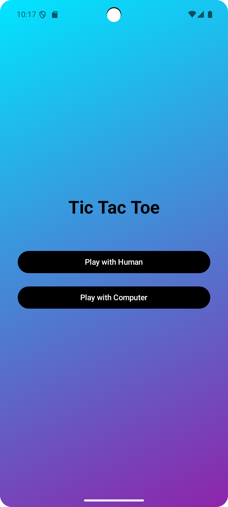
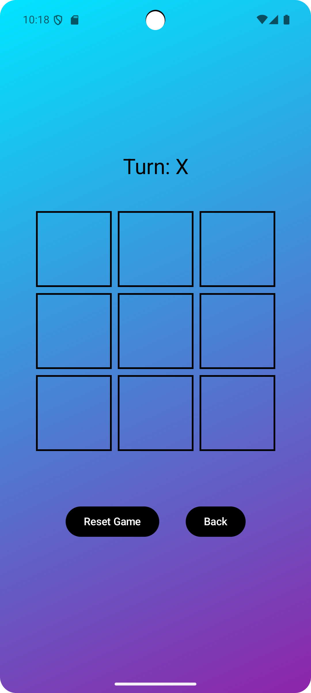
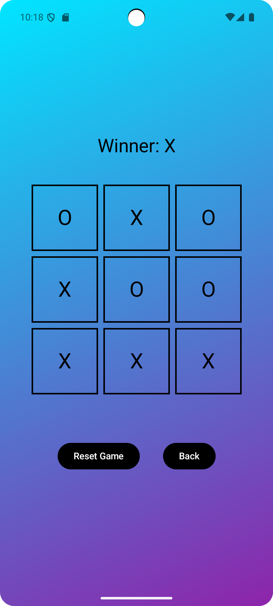

# ✨ Tic Tac Toe AI Game – Built with Jetpack Compose

Welcome to a sleek and interactive **Tic Tac Toe** experience crafted using **Jetpack Compose**! Challenge yourself against a basic AI opponent in a beautifully animated and intuitive interface.

---
<br>

<p align="center">
  
</p>

---

## 🎮 Features

- ✅ Play against AI (basic random logic)
- 🎨 Beautiful gradient background using Jetpack Compose
- 📱 Fully responsive UI
- 🔄 Reset button to restart the game
- 🔙 Back navigation support
- ✖️⭕ Classic 3x3 grid gameplay
- 🔍 Uses state management with `remember` and `LaunchedEffect`

---

## 📸 Screenshots

### Game Screens 



---

## 🛠️ Built With

- [Kotlin](https://kotlinlang.org/)
- [Jetpack Compose](https://developer.android.com/jetpack/compose)
- [Android Studio](https://developer.android.com/studio)

---

## 🚀 Getting Started

### Prerequisites
- Android Studio Meerkat 
- Kotlin 1.8+
- Compose Compiler compatible with your Kotlin version

### Run the App
1. Clone the repo:
   ```bash
   git clone https://github.com/your-username/tictactoe-compose.git

2. Open in Android Studio.

3. Click Run ▶️ on your emulator or device.

## 🤝 Contributing

Contributions are welcome! Feel free to fork the project and submit a pull request.

## Get us a Coffee ❤️

[](https://buymeacoffee.com/aditya1875q)

---

Made with ❤️ by Dev-Aditya-More

